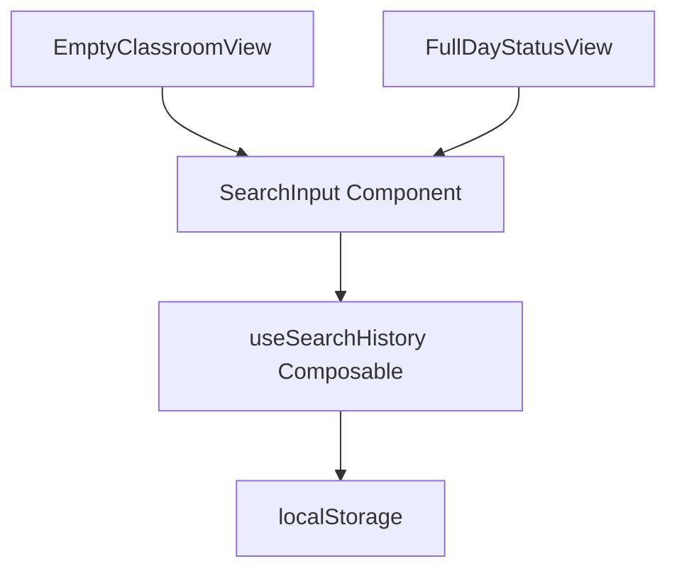
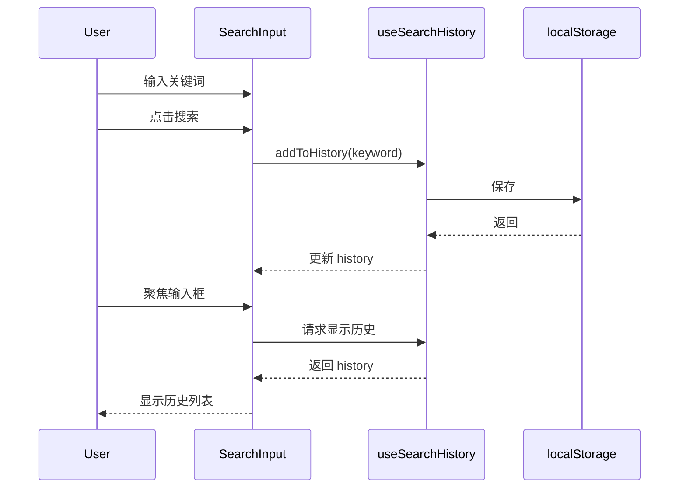

# Search History Feature

Feature Name: search-history
Updated: 2026-03-24

## Description

为教学楼搜索框增加历史记录缓存功能，使用 localStorage 持久化存储用户的历史搜索关键词，提升搜索体验。

## Architecture



## Components and Interfaces

### useSearchHistory Composable

负责搜索历史的存储、读取和展示。

```typescript
// 返回类型
interface UseSearchHistoryReturn {
  history: Ref<string[]>           // 显示用历史记录（最多5条）
  showHistory: Ref<boolean>        // 是否显示历史列表
  addToHistory: (keyword: string) => void  // 添加搜索记录
  clearHistory: () => void        // 清除所有历史
  selectHistory: (keyword: string) => void // 选择某条历史
}
```

### 实现逻辑

1. **addToHistory(keyword)**:
   - 去除空白字符
   - 如果已存在相同关键词，先删除
   - 添加到数组头部
   - 限制最多 10 条
   - 同步到 localStorage

2. **showHistory 控制**:
   - 输入框聚焦时显示
   - 用户开始输入时隐藏
   - 选择历史项后隐藏

## Data Flow



## Correctness Properties

- 历史记录按时间倒序排列
- 相同关键词不会被重复添加（会移动到顶部）
- 最多保存 10 条，最多显示 5 条
- 页面刷新后历史记录不丢失

## Error Handling

- localStorage 不可用时优雅降级，不显示历史记录功能
- 存储失败时忽略，不阻塞搜索流程

## Test Strategy

1. 单元测试: useSearchHistory 各方法逻辑
2. 手动测试:
   - 搜索后检查 localStorage
   - 刷新页面后检查历史是否恢复
   - 检查数量限制是否生效
